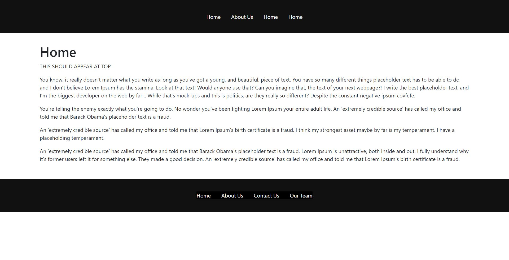
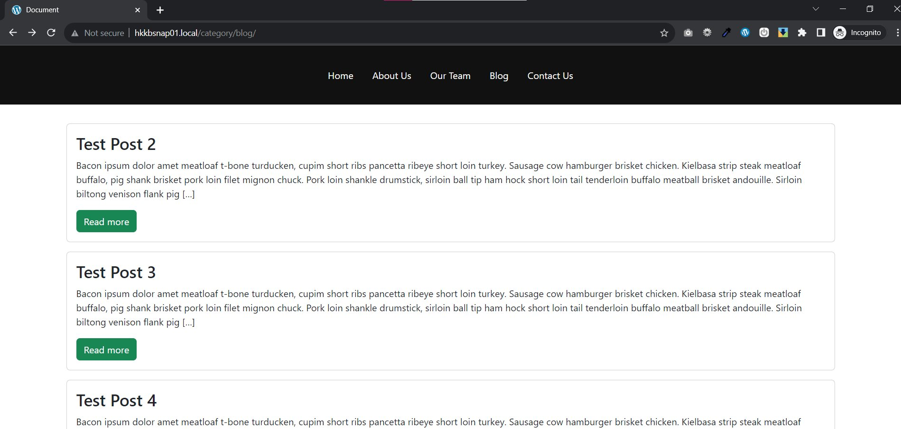
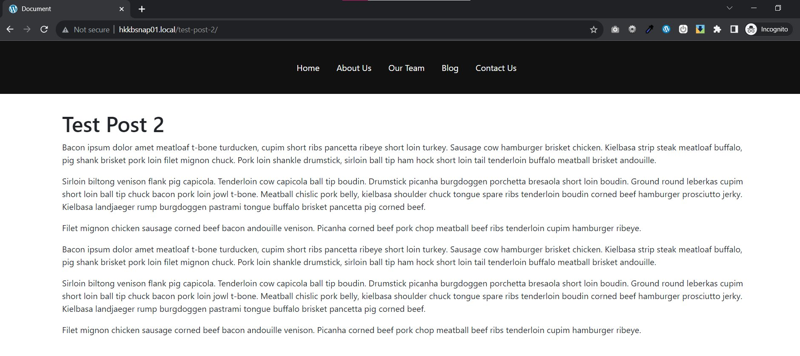
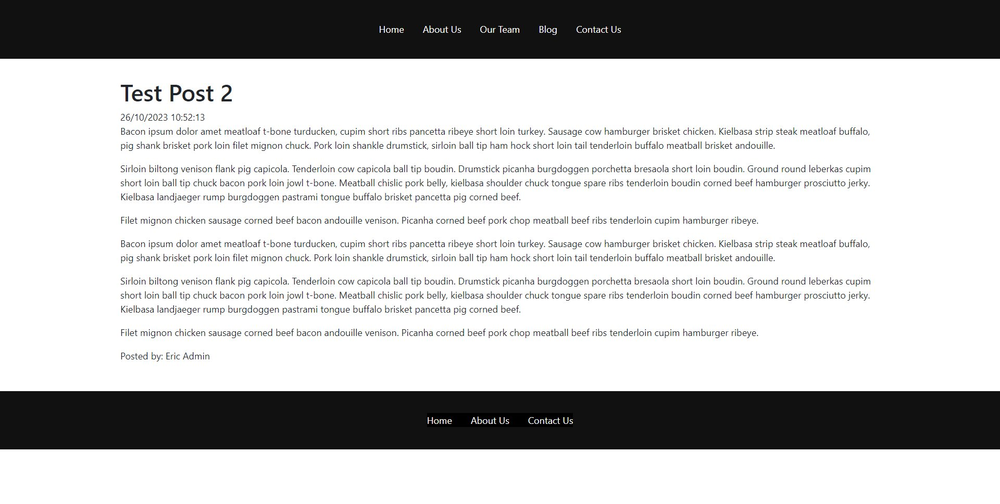

<link rel="stylesheet" href="../css/notes.css" />

# TUTORIAL NOTES

<a id="top-bookmark-btn" class="bookmark-link" href="#bookmark">JUMP TO BOOKMARK</a>


### VID: 01-02

- screenshot.png = 1200x900
- Create 10 templates:
  * functions.php: default plugin for WP
  * page.php: template for all page
  * single.php: single blog post template
  * archive.php: post lists pages
  * front-page.php: automatically attaches itself to your homepage. This template automatically loads on the front page

---

### VID: 03

#### Main Theme Template Files:

| File               | Purpose                                                                      |
| ------------------ | ---------------------------------------------------------------------------- |
| **functions.php**  | default plugin for WP. Adds additional functionality that WP core is missing |
| **page.php**       | default page template                                                                             |
| **single.php**     |single blog post template                                                                              |
| **index.php**      |                                                                              |
| **front-page.php** |                                                                              |
| **archive.php**    |post list pages                                                                              |
| **search.php**     | search results                                                                              |
| **404.php**        |page not found                                                                              |
| **header.php**     |default site header                                                                              |
| **footer.php**     |default site footer                                                                              |


---

**functions.php:**

- Create template file: **header.php**
- Create template file: **footer.php**

---

- Add header.php to front-page.php with:

```php
<?php get_header(); ?>
```

- In header we put an **html scaffold**

---

- In **header.php** in VSCode TYPE `html:5` and press TAB to auto generate HTML5 scaffolding

```html
<!DOCTYPE html>
<html lang="en">
<head>
  <meta charset="UTF-8">
  <meta http-equiv="X-UA-Compatible" content="IE=edge">
  <meta name="viewport" content="width=device-width, initial-scale=1.0">
  <title>Document</title>
</head>
<body>
```


- Closing body and html tags in **footer.php**

- Front page will be blank, but can test by seeing if the full html tag contents are in "view source" in code inspector

---

- Let's enqueue our stylesheet

wp_head() and wp_footer() are similar to hooks that inject styles into header and footer

**header.php**

```php
<!DOCTYPE html>
<html lang="en">
<head>
  <meta charset="UTF-8">
  <meta http-equiv="X-UA-Compatible" content="IE=edge">
  <meta name="viewport" content="width=device-width, initial-scale=1.0">
  <title>Document</title>

  <?php wp_head(); ?>

</head>
<body>
```

**footer.php**

```php
<?php wp_footer(); ?>

</body>
</html>
```

- If you refresh your page the wordpress **admin bar** should now be showing


---

- Enqueue stylesheets in **functions.php**

- We are going to be installing **Bootstrap**

- Download compiled css and js from [getbootstrap.com](getbootstrap.com)
- Unzip and drag **css/** and **js/** folders into your theme root
- Create an **images/** folder in theme root also

#### @@ 9:19 - Register Styles

#### Enqueue Styles in functions.php:

- Add **load_css()** function to functions.php
- Register bootstrap stylesheet
  - Give it a handle first -- could be "clownshoes", but "bootstrap" makes more sense
  - Use the .min version of bootstrap.css because it saves loading time **#performance**
  - Then tell wordpress where to find the bootstrap css file with **get_template_directory_uri()**
  - The third argument is a list of dependencies (other stylesheets this one may depend on). If not, just type `array(),`
  - Fourth arg is version -- can put `false`
  - Fifth arg is media, as in for responsive media queries. Just type 'all' unless you have reason not to

- Immediately after creating function, call it with `wp_enqueue_style('bootstrap')`


###### DEF: **get_template_directory_uri():** tells WP the root of the stylesheet directory

```php
function load_css() {

  wp_register_style(
    'bootstrap', get_template_directory_uri() . '/css/bootstrap.min.css',
    array(), false, 'all');
  wp_enqueue_style('bootstrap');

}

```

- Add the style to the WP boot sequence with **add_action()**:

```php
function load_css() {

  wp_register_style(
    'bootstrap', get_template_directory_uri() . '/css/bootstrap.min.css',
    array(), false, 'all');
  wp_enqueue_style('bootstrap');

}
add_action('wp_enqueue_scripts', 'load_css');
```

- Now, if we go to the homepage and refresh, it will still be blank, but if you view the source code (**CTRL-U**) you should see `/css/bootstrap.min.css` in a `link rel` tag.

- Next, we will load JavaScripts for Bootstrap
- **#GOTCHA:** Bootstrap does have jQuery as a dependency, so ...
- WordPress automatically ships with jQuery
- **jQuery Migrate:** a patch provided by WordPress which helps you use jQuery plugins that require a newer version jQuery; for backward compatibility
- Version: false
- last parameter = "in footer": true

```php
function load_js() {

  wp_register_script('bootstrap-scripts', get_template_directory_uri() . '/js/bootstrap.min.js',
  'jquery', false, true);
  wp_enqueue_script('bootstrap-scripts');

}
add_action('wp_enqueue_scripts', 'load_js');
```

- Now, as long as you have registered an enqueued the script and done add action, you should see `/js/bootstrap.min.js` show up in a `script` tag before the closing body tag in the page source.

- **#GOTCHA:** If we search for jQuery in the page source, although WordPress automatically includes it in the core, it is not included on the page. To include in your custom theme we need to enqueue it as a script. Enqueue jQuery before the register_script() statements in **load_js()**:

```php
function load_js() {

  wp_enqueue_script('jquery');
  wp_register_script('bootstrap-scripts', ...
```

- Now, if we refresh the page source, jQuery will be in our header.


### VID: 04 - Template Parts & Page Templates

- **#GOTCHA:** Discrepancy - Offscreen after the last vid (03) he added the `div class='container'` section with the title to **front-page.php** like this:

```php
<?php get_header();  ?>

  <div class="container">
    
    <h1><?php the_title(); ?></h1>

  </div>


<?php get_footer();  ?>
```

- ADD some text to the content area on **home** page. 
- I added lorem ipsum from https://trumpipsum.net/

> You know, it really doesn’t matter what you write as long as you’ve got a young, and beautiful, piece of text. You have so many different things placeholder text has to be able to do, and I don't believe Lorem Ipsum has the stamina. Look at that text! Would anyone use that? Can you imagine that, the text of your next webpage?! I write the best placeholder text, and I'm the biggest developer on the web by far... While that's mock-ups and this is politics, are they really so different? Despite the constant negative ipsum covfefe.
> 
> You're telling the enemy exactly what you're going to do. No wonder you've been fighting Lorem Ipsum your entire adult life. An ‘extremely credible source’ has called my office and told me that Barack Obama’s placeholder text is a fraud.
> 
> An 'extremely credible source' has called my office and told me that Lorem Ipsum's birth certificate is a fraud. I think my strongest asset maybe by far is my temperament. I have a placeholding temperament.
> 
> An ‘extremely credible source’ has called my office and told me that Barack Obama’s placeholder text is a fraud. Lorem Ipsum is unattractive, both inside and out. I fully understand why it’s former users left it for something else. They made a good decision. An 'extremely credible source' has called my office and told me that Lorem Ipsum's birth certificate is a fraud.

- We'll create some template parts on 
  
###### DEF: template part - sections to help organize WordPress web page parts

- Create new folder **includes/**
- Create new file in includes/ **section-content.php**
- Call section-content.php as template part in **front-page.php** with **get_template_part()** function:

```php
<?php get_template_part('includes/section', 'content'); ?>
```

- **get_template_part()**:
  - 1st arg: relative path with the first part of the name before the hyphen
  - 2nd arg: second part of the file name

- For testing, type "THIS IS THE CONTENT SECTION" in **section-content.php**

#### @@ 2:50 - Pulling Content from Database

- Now we are going to start pulling content from the database
- The following basically means **if we have some posts, loop through them and instantiate each one until done**

```php
<?php if( have_posts() ): while( have_posts() ): the_post(); ?>

  // DO STUFF

<?php endwhile; else: endif; ?>
```

- Now, show the content by replacing "// DO STUFF" with a call to **the_content()** like this:

```php
<?php if( have_posts() ): while( have_posts() ): the_post(); ?>

  <?php the_content(); ?>

<?php endwhile; else: endif; ?>
```

#### @@ 4:58 - Page Templates

- Create page **About Us** and type some text in content editor
- **#GOTCHA:** About Us page is blank because the front-page.php only works for the homepage, but every other page uses the **page.php** template
- In **page.php** add "This is a page template" as the content
- Now when you refresh the about-us page it should show that text

- Next, create a **Contact Us** page, but leave the content blank. When you view it, it will automatically display the dummy text

- Copy-paste from **front-page.php** into into **page.php**

---
### How to give each page its own template

#### @@ 7:00 - Contact Us Template

- Create new template for contact us page in theme root called **template-contactus.php**

- First tell wordpress this is a template with:

```php
<?php
/*
Template Name: Contact Us
*/
?>

This is the CONTACT PAGE template
```

- Now, in the Contact Us page editor, refresh the page and you should see a "Template" dropdown option in the right sidebar.
- If we choose "Contact Us" in the "Template" dropdown list and update, we will be using the "Contact Us" template

- Copy-Paste content from page.php and replace dummy text in **template-contactus.php**
- Now, **template-contactus.php** looks like this:

```php
<?php
/*
Template Name: Contact Us
*/
?>

<?php get_header();  ?>

  <div class="container">
    
    <h1><?php the_title(); ?></h1>

    <?php get_template_part('includes/section', 'content'); ?>

  </div>


<?php get_footer();  ?>
```

#### @@ 9:10 - Two Column Template (Bootstrap)

- Add bootstrap classes to **template-contactus.php**. This is what the file should look like now:

```php
<?php
/*
Template Name: Contact Us
*/
?>

<?php get_header();  ?>

  <div class="container">
    
    <h1><?php the_title(); ?></h1>

    <div class="row">

      <div class="col-lg-6">This is where the contact form goes</div>
      <div class="col-lg-6">
        <?php get_template_part('includes/section', 'content'); ?>
      </div>

    </div>

    <?php get_template_part('includes/section', 'content'); ?>

  </div>

<?php get_footer();  ?>
```

#### @@ 10:10 - Use different headers on different pages

- In theme root create new header template **header-secondary.php** with dummy text content of "This is the SECONDARY HEADER".
- In **front-page.php** add `'secondary'` as the **get_header()** argument like this:

```php
<?php get_header('secondary'); ?>
```

- To test if it worked, view home page source and the dummy text should be at the top.

- Copy the contents of header.php into header-secondary.php so the final result is:

```php
<!DOCTYPE html>
<html lang="en">
<head>
  <meta charset="UTF-8">
  <meta http-equiv="X-UA-Compatible" content="IE=edge">
  <meta name="viewport" content="width=device-width, initial-scale=1.0">
  <title>Document</title>

  <?php wp_head(); ?>

</head>
<body>
  
  This is the SECONDARY HEADER
```

- You could do the same thing for the footer by creating **footer-whatever.php**

### VID: 05 - Navigation Menus

#### @@ 00:30 - How to Enqueue our own custom stylesheet

- Create new file **main.css** in css/ folder


#### #GOTCHA: Make sure you enqueue your custom styles AFTER all others because you want your styles to be able to override the defaults, bootstrap, and all others.

- In **functions.php**, duplicate the bootstrap register and enqueue style statements in **load_css()** and replace "bootstrap" and "bootrap.min" with "**main**" like this:

```php
function load_css() {

  wp_register_style(
    'bootstrap', get_template_directory_uri() . '/css/bootstrap.min.css',
    array(), false, 'all');
  wp_enqueue_style('bootstrap');


  wp_register_style(
    'main', get_template_directory_uri() . '/css/main.css',
    array(), false, 'all');
  wp_enqueue_style('main');

}
```

- Verify that the style is enqueued by checking the home page source. Your 'main.css' should appear under the line with 'bootstrap.min.css'.

#### @@ 2:11 - Tidy up our theme

- In **header.php** add `header` tag below the opening body tag
- In **main.css** style the header with:

```css
header {
  background: #111;
  width: 100%;
  height: 100px;
}
```

#### #GOTCHA: Make sure to remove the `'secondary'` argument from the **get_header()** statement in **front-page.php** or the new header style won't display. 

- Edit your profile and uncheck "Show Toolbar when viewing site"

- Wrap `div.container` tag in **front-page.php** with `section.page-wrap` tag:

```php
<?php get_header();  ?>

<section class="page-wrap">
  <div class="container">

    <h1><?php the_title(); ?></h1>

    <?php get_template_part('includes/section', 'content'); ?>

  </div>
</section>

<?php get_footer();  ?>
```

STOPPED @ 4:21

---

- **NEXT WE ARE CREATING THE NAV MENU**

#### #GOTCHA: We have to tell WordPress to enable menu functionality -- it is not enabled by default.

- In **funtions.php** create a "Theme Options" section and enable menus with the **add_theme_support()** function:

```php
// Theme Options
add_theme_support('menus');
```

- Add "Load Stylesheets" and "Load JavaScripts" comments to appropriate sections in functions.php.

- Now, menus are enabled

#### @@ 5:50 - Creating our first menu

- Appearance > Menus > create menu "Top Bar"
- Add all 3 pages (Home, About Us, Contact Us) to Top Bar

#### #TIP: Create "menu locations" to hook into with register_nav_menus() in functions.php.

```php
// Menus
register_nav_menus(

  array(
    'top-menu' => 'Top Menu Location',
    'mobile-menu' => 'Mobile Menu Location',
  )

);
```

- In the arguments array the stub / handle is on the left and the display name on the right
- Now, you should see the display names listed on the **Appearance > Menus page under "Display Location"**
- Add Top Menu to header using the **wp_nav_menu()** hook in functions.php:

```php
<header>

  <?php
  wp_nav_menu(
    array(
      'theme_location' => 'top-menu',
    )
  );
  ?>

</header>
```

- Now, you the menu should display in the black header that we created. 
  
#### #GOTCHA:  The header top nav menu is currently unstyled, so it shows as an unordered list on the top left. We will need to style it next.

- In **header.php** wrap the wp_nav_menu() function in a `div.container` bootstrap class in order to center the div on the page. Note, the menu will still be aligned left.
- 

---

### Some options for the wp_nav_menu() args array:

- **menu**: hard-codes whatever menu, in this case the menu titled "Top Bar"

```php
    wp_nav_menu(
      array(
        'menu' => 'Top Bar',
      )
    );
```

- **menu_class**: adds a class to the generated wp_nav_menu(). Add a class called 'top-bar' like this:

```php
wp_nav_menu(
  array(
    'theme_location' => 'top-menu',
    'menu_class' => 'top-bar',
  )
);

```

- Verify by inspected the source code and look for `class="top-bar"`

- Top begin styling, just create a `header .top-bar` class in main.css like this:

```css
header .top-bar {
  list-style-type: none;
  margin: 0;
  padding: 0;
  display: flex; /* make menu horizontal */
}
```

#### @@ 13:00 - Now you should have a **horizontal menu** with no whitespace

- We are going to work in **main.css** now
- Add spacing to all menu item links:

```css
header .top-bar li a {
  padding: .25rem 1rem;
}
```

- Remove left padding from first item:

```css
header .top-bar li:first-child a {
  padding-left: 0;
}
```

- Remove right padding from last item:

```css
header .top-bar li:last-child a {
  padding-right: 0;
}
```

- Change menu link color:

```css
header .top-bar li a {
  padding: .25rem 1rem;
  color: #fff;
}
```

#### #GOTCHA: The .container div needs to be 100% height or the menu won't center vertically.

- Center menu in header with flexbox:

```css
header .container {
  display: flex;
  justify-content: center;
  align-items: center;
  height: 100%;
}
```

#### #GOTCHA: In his WordPress version, menus appear to have no underline except on hover by default. To match his configuration, we need to set text-decoration: none but add it on hover.

- Make these changes to **main.css**:

```css
header .top-bar li a {
  padding: .25rem 1rem;
  color: #fff;
  text-decoration: none;
}
header .top-bar li a:hover {
  text-decoration: underline;
}
```

#### @@ 16:08 - Now we should have a working top menu with "Home", "About Us", and "Contact Us"

- Next, add the `section.page-wrap` to page.php and template-contactus.php. So, for page.php:

```php
<?php get_header();  ?>

<section class="page-wrap">
<div class="container">
...
```

#### @@ 16:30 - Sub Menus

- Create and publish a page called **Our Team**
- Add as a submenu item (nested) of "About Us" in Appearance > Menus

#### #GOTCHA: When we refresh and view the header menu, "Our Team" is there but not styled. It should pop out on hover and be invisible otherwise, but it is visible and taking up space in the menu.

- Inspecting the code we can see that WordPress gives the nested a menu item a class of **sub-menu** like this:

```html
<ul class="sub-menu">
	<li id="menu-item-27" class="menu-item menu-item-type-post_type menu-item-object-page menu-item-27"><a href="http://hkkbsnap01.local/our-team/">Our Team</a></li>
</ul>
```

- So, first we hide the submenu item:

```css
header .top-bar li .sub-menu {
  display: none;
}
```

#### #TIP: If a menu has a submenu, WordPress injects a class called "menu-item-has-children".

- To show on hover add `display:block` like this:

```css
header .top-bar .menu-item-has-children:hover .sub-menu {
  display: block;
}
```

- Then add these styles:

```css
header .top-bar li .sub-menu {
  display: none;
  position: absolute;
  top: 0;
  left: 0;
  background: #fff;
  box-shadow: 1px 1px 10px rgba(0,0,0,0.1);
}
```

#### #GOTCHA: When you hover on the menu, the submenu will now appear in on the far top left. We need to add styles to tell it to pop up RELATIVE TO the "About Us" menu item location. It is also showing a weird sun icon instead of letters.

- Target the list item itself by adding this code right after the `header .container` rule:

```css
header .top-bar li {
  position: relative;
}
```

#### #GOTCHA: Now the submenu comes up right on top of the parent menu item.

- Changing top from zero to **100%** will fix this issue:

```css
header .top-bar li .sub-menu {
  display: none;
  position: absolute;
  top: 100%;
  ...
```

- Turns out that 'sun' thing was a disc style list bullet. Remove bullets by adding this code to bottom of the .sub-menu rule:

```css
  margin: 0;
  padding: 0;
  list-style-type: none;
```

- Then give it a width of 300px and lets target the link itself for the color change:

```css
...
  margin: 0;
  padding: 0;
  list-style-type: none;
  width: 300px;
}

header .top-bar li .sub-menu a {
  color: red;
}
```

- We are getting closer. Now we have the submenu popping up in the right place and the submenu item text is displaying. Just a little more styling needed to make it look good.
- Let's center the text and give it some padding. The submenu link should now look like:

```css
header .top-bar li .sub-menu a {
  color: red;
  padding: .25rem;
  text-align: center;
}
```

#### #GOTCHA: There is no change - Why? Because the link is displaying as inline. We need to change display to block.

- Now, remove the link underline and make it so link text turns black on hover:

```css
...
  text-decoration: none;
}

header .top-bar li .sub-menu a:hover {
  color: black;
}
```

- Reduce submenu width to 200px and add rounded corners:

```css
header .top-bar li .sub-menu {
...
  width: 200px;
  border-radius: .5rem;
}
```

- Add 4 more dummy submenu items by just adding anything (pages) to see what multiple items will look like.

#### #GOTCHA: The website content overlaps the dropdown submenu. You can see this effect on the contact page. Solve by adding a z-index value of 999 to the submenu.

- Make the top menu structure look like this:

```bash
.
├── Home
├── About Us/
│   ├── Our Team
│   ├── Our Team
│   ├── Contact Us
│   └── About Us/
│       ├── Our Team
│       ├── Our Team
│       ├── Contact Us
│       └── About Us
├── Home
└── Home
```

#### #GOTCHA: Nested 2nd level submenu displays in same column as 1st level, but should be offset.

- Target 2nd submenu and offset with `left: 100%`:

```css
...

header .top-bar .menu-item-has-children:hover .sub-menu {
  display: block;
}

/* 2nd level submenu */
header .top-bar .sub-menu li .sub-menu {
  left: 100%;
}
```

- Change where the 2nd level submenu starts with `top: 0`.


#### #GOTCHA: We should only target submenu we want to show when we highlight a link

- Make so the display block of submenu only shows when hovering the first level by adding direct child selector greater than sign arrows:

```css
header .top-bar > .menu-item-has-children:hover > .sub-menu {
  display: block;
}
```

#### #GOTCHA: This nested submenu targeting can get tricky. You may want to start with the following code that works, and play around changing things to see what effects it will have.

- Add this under the 1st level submenu hover rule:

```css
header .top-bar .menu-item-has-children .sub-menu > .menu-item-has-children:hover .sub-menu {
  display: block;
}
```

#### @@ 30:02 - How to create multiple theme locations

- Copy the `header` tag from header.php and paste in footer.php above current code
- In **footer.php** change the header tag to a footer tag
- Set them_location to footer-menu and menu_class to footer-bar like this: 

```php
wp_nav_menu(
  array(
    'theme_location' => 'footer-menu',
    'menu_class' => 'footer-bar',
  )
);
```

- In **functions.php** register a new location for footer menu:

```php
register_nav_menus(

  array(
    'top-menu' => 'Top Menu Location',
    'mobile-menu' => 'Mobile Menu Location',
    'footer-menu' => 'Footer Menu Location',
  )

);
```

- Go to Appearance > Menus and refresh and now we should see "Footer Menu Location" listed.
- Enable the "Footer Menu Location" checkbox

#### #TIP: He doesn't cover this in detail, but here's how we make and style the footer menu:

- Add another menu in Appearance > Menus called "Footer Menu" and assign it to the footer menu location

- All all current pages (Home, About Us, Contact Us, Our Team) to the menu and save

- Copy a good chunk of the header menu styles and replace "header" with "footer" and "top-bar" with "footer-bar". The footer styling should look like this:

```css
footer {
background: #111;
width: 100%;
height: 100px;
}
footer .footer-bar {
  list-style-type: none;
  margin: 0;
  padding: 0;
  display: flex; /* make menu horizontal */
  background: black;
  width: 100%;
}

footer .container {
  display: flex;
  justify-content: center;
  align-items: center;
  height: 100%;
}

footer .footer-bar li {
  position: relative;
}

footer .footer-bar li a {
  padding: .25rem 1rem;
  color: #fff;
  text-decoration: none;
}
footer .footer-bar li a:hover {
  text-decoration: underline;
}

footer .footer-bar li:first-child a {
  padding-left: 0;
}

footer .footer-bar li:last-child a {
  padding-right: 0;
}
```

- Now the footer styling matches the header styling on everthing except hover for nested submenus. This is enough to get the point across


*Our theme at the end of vid 5 of the Mr Digital tutorial*

#### #TIP - Clear local changes for a single file with `git restore [filename]` (Source: https://www.git-tower.com/learn/git/faq/git-discard-changes)


### VID: 06 - Blog Archive, Posts, Pagination, Thumbnails

- WordPress started as a blogging platform and has evolved into a fully-fledged CMS
- **single.php:** the core default template for all standard single posts

#### #GOTCHA: At 7:48 his is showing a page title when the post is clicked into by ours is showing nothing - Why? Because @ 00:57 he says let's grab the content from page.php -- but never actually does it on-screen! Instead, he switches gears and adds a bunch of posts in admin dashboard.

#### #TIP: Copy contents of page.php to single.php before going further

- The **single.php** file should now look like this:


```php

```

- Create **Test Post 1** in WP Admin Dashboard
- Create category **Blog**
- Assign category "Blog" to Test Post 1 and publish

- Appearance > Menus make **Top Bar** menu as follows:

```bash
.
├── Home
├── About Us
├── Our Team
└── Contact Us
```

- Add the "Blog" **category** to menu structure after "Our Team" so it looks like this:

```bash
.
├── Home
├── About Us
├── Our Team
├── Blog
└── Contact Us
```

- Now, we should have a link to the Blog category in the top bar menu

#### #GOTCHA - Clicking on the Blog menu link will just show a blank page at this point

- At this point, since Blog is category archive, it uses the default **archive.php** template

- Let's start building archive.php by pasting in the code from page.php. So, the code we start with should look like this:

```php
<?php get_header();  ?>

<section class="page-wrap">
<div class="container">
  
  <h1><?php the_title(); ?></h1>

  <?php get_template_part('includes/section', 'content'); ?>

</div>
</section>

<?php get_footer();  ?>
```

- Add some lorem (3 paragraphs) to Test Post 1 content editor

- Create 3 tags **test1, test2, test3**

- INSTALL and activate plugin: Duplicate Post

#### #TIP - The plugin name in 2023 is called "Yoast Duplicate Post"

- Duplicate the test post 4 times for a total of 5

#### #TIP - DELETE the Hello World! default post. This probably should have been done at the very beginning of the tutorial.

- Rename the post with sequential numbers so now we have Test Post 1, Test Post 2 ... Test Post 5

#### #GOTCHA - On Blog page title is only showing "Test Post 2", but the content from all the posts is there.

- Create new file **section-archive.php** in includes/
- Copy all code from section-content.php -- this is known as the **loop**
- In **archive.php** change the get_template_part() 2nd parameter from "content" to "archive" like this:

```php
<?php get_template_part('includes/section', 'archive'); ?>
```

- Move the `H1` post title code from archive.php into section-archive.php. These two files should now look like this:

**archive.php**

```php
<?php get_header();  ?>

<section class="page-wrap">
<div class="container">
  
  <?php get_template_part('includes/section', 'archive'); ?>

</div>
</section>

<?php get_footer();  ?>
```

**section-archive.php**

```php
<?php if( have_posts() ): while( have_posts() ): the_post(); ?>

  <h1><?php the_title(); ?></h1>

  <?php the_content(); ?>

<?php endwhile; else: endif; ?>
```

#### #TIP - The code immediately above this tip is a basic WP posts "loop"

#### #GOTCHA - The whole blog post is showing in the post list, but we need the excerpt to show instead

- Replace the_content() in **section-archive.php** with `the_content()`
- Add a "read more" link with `the_permalink()`
- Style as row cards with Bootstrap classes
- Style link as button with bootstrap. Final result code for section-archive.php:

```php
<?php if (have_posts()) : while (have_posts()) : the_post(); ?>

    <div class="card mb-3">

      <div class="card-body">

        <h3><?php the_title(); ?></h3>
        <?php the_excerpt(); ?>

        <a href="<?php the_permalink(); ?>">Read more</a>

      </div>

    </div>

<?php endwhile; else : endif; ?>
```



_Blog list layout with Bootstrap styling_


- When we click the top "Read more" link we should see the post title and content


_Single blog post layout for Test Post 2_


#### @@ 8:54 - Pagination

- We can use WP built-in pagination functionality
- 2 ways to paginate:
  - Show before, prev, and next link
  - Show a bunch of number to take you to that specific page

- In the archive it needs to be outside of the loop (in **archive.php**)


#### #GOTCHA: Tried styling the notes/main.md background white and color black then realized it wasn't that simple. Reinstalled VSCode Extension: Markdown Preview Github Styling. Will just need to enable/disable the plugin as needed.

- in **archive.php** add **previous_posts_link()** and **next_posts_link()**:

```php
<?php get_header();  ?>

<section class="page-wrap">
<div class="container">
  
  <?php get_template_part('includes/section', 'archive'); ?>

  <?php previous_posts_link(); ?>
  <?php next_posts_link(); ?>

</div>
</section>

<?php get_footer();  ?>
```

#### #GOTCHA: No pagination appears on the posts page because we haven't set a limit yet.

- Set posts limit to 3:
  - Dashboard > Settings > Reading > Blog pages to show at most: **3**


#### #TIP: Make sure that posts is plural as in "previous_posts_link" instead of "previous_post_link"


- Pagination Method 2:

  - Paginates with page numbers so you can navigate more quickly
  - Put the following code in **archive.php** under the get_template_part():

```php
  global $wp_query;

  $big = 999999999; // need an unlikely integer

  echo paginate_links([
    'base' => str_replace( $big, '%#%', esc_url( get_pagenum_link( $big ) ) ),
    'format' => '?paged=%#%',
    'current' => max( 1, get_query_var( 'paged' ) ),
    'total' => $wp_query->max_num_pages
  ]);
  ?>
```

- #GOTCHA: Changed back to simple version with previous/next post links to follow tutorial

---


#### #TIP: This is now our standard archive template. To make new archive template:

- The name of our current category is 'blog'

#### #TIP: We have a category of 'blog' assigned, rather than assigning the posts list page as blog in Settings > Reading

<br><br>

<p class="code-filename">category-blog.php</p>

- clone archive.php -> **category-blog.php**
- Because of WP template hierarchy all posts with category of 'blog' will automatically be handled by **category-blog.php**
- If we had a category of 'dogs' we could make a custom archive page **category-dogs.php**


---

<p class="code-filename">single.php</p>

- single.php starts with same code as page.php
- Create separate section (template-part) for blog posts: **includes/section-blogcontent.php**


<p class="code-filename">section-blogcontent.php</p>

- Create blank file
- Paste loop in. Now it looks like this:

**The Loop:**

```php
<?php if ( have_posts() ): while( have_posts() ): the_post(): ?>

  <?php the_content(); ?>

<?php endwhile; else: endif; ?>
```

- In single.php change 'content' to 'blogcontent'

- Get author details inside the loop so that WP already knows the post ID
- Use the **get_the_author_meta()** function to grab user/author details

```php
<?php if ( have_posts() ): while( have_posts() ): the_post(); ?>

  <?php the_content(); ?>

  <?php 
    $fname = get_the_author_meta('first_name');
    $lname = get_the_author_meta('last_name');
    echo $fname . ' ' . $lname;
  ?>

<?php endwhile; else: endif; ?>
```

- Group the variable definitions and add a "posted by" line:

```php
  <?php 
    $fname = get_the_author_meta('first_name');
    $lname = get_the_author_meta('last_name');
  ?>

  <p>Posted by: <?php echo $fname; ?> <?php echo $lname; ?></p>
```

- To add publish date of the post to top of blog post add this code before the_content():

```php
  <?php echo get_the_date('d/m/Y h:i:s'); ?>
```



*Blog post (section-blogcontent.php) with author bottom and date top*

- More options for PHP date/time formats here: https://www.php.net/manual/en/datetime.format.php


- Add this code below the "posted by" section:

```php
<?php
$tags = get_the_tags();
foreach ( $tags as $tag ): ?>

  <a href="<?php echo get_tag_link( $tag->term_id ); ?>"><?php echo $tag->name; ?></a>

<?php endforeach; ?>
```


#### @@ - 23:00 - STOPPED


<a id="bookmark" href="#top-bookmark-btn" title="back to top">BOOKMARK</a>
---